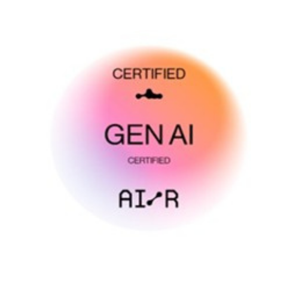
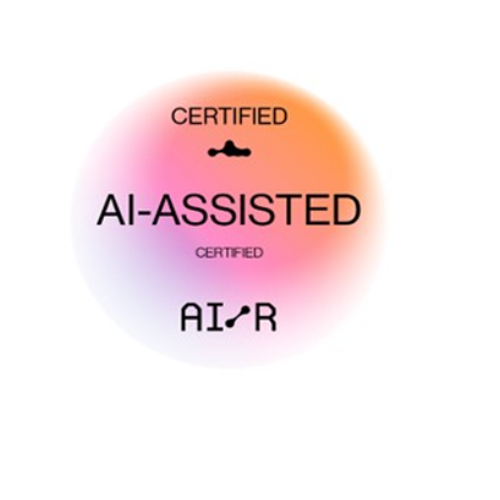

  

# 🚀 Olá, eu sou Katcilane Silva

Engenheira de Software em início de carreira, com certificação **AWS Cloud Practitioner** e paixão por construir soluções que unem dados, Inteligência Artificial e computação em nuvem.

## Sobre mim

✨ Recentemente, concluí meu estágio na **Compass UOL** na trilha de **Data & Inteligência Artificial**, onde desenvolvi projetos práticos utilizando o ecossistema AWS, aplicando conceitos de Machine Learning e IA Generativa para resolver problemas reais.

Essa experiência consolidou minha migração para a área de tecnologia, onde venho me dedicando ao aprimoramento constante em desenvolvimento de software, algoritmos e cloud. Atualmente, continuo a expandir meu conhecimento como Desenvolvedora e Analista de Dados voluntária na **Itaipu Parquetec** e como pesquisadora em visão computacional no **IFMS**.

Estou em busca de uma oportunidade como **Engenheira de Software, IA/ML ou áreas correlatas** para aplicar minhas habilidades, colaborar em equipes inovadoras e continuar crescendo profissionalmente.

## 💻 Habilidades Tecnológicas

| Categoria | Tecnologias |
| :--- | :--- |
| **Linguagens** | Python, JavaScript, Java |
| **Cloud & AWS** | AWS Cloud Practitioner, AWS Lambda, Amazon S3, EC2, Bedrock, SageMaker, IAM |
| **IA & Machine Learning** | Machine Learning, IA Generativa, Processamento de Linguagem Natural (PNL), Redes Neurais (CNNs), Visão Computacional, RAG |
| **Ferramentas & Frameworks** | Git, Docker, Terraform, Boto3, Flask, FastAPI, LangChain, Pandas, Matplotlib |
| **Desenvolvimento** | APIs REST, Metodologias Ágeis, Estrutura de Dados, Algoritmos |

## 🚀 Projetos de Destaque

#### 🤖 Chatbot Jurídico com IA Generativa
- **Descrição:** API em FastAPI com LangChain e Amazon Bedrock para analisar e responder perguntas sobre documentos jurídicos, com deploy em container Docker.
- **Tecnologias:** `Python`, `FastAPI`, `LangChain`, `Amazon Bedrock`, `Docker`.

#### 🌿 Sistema de Análise Socioambiental (Parceria IFMS & Itaipu)
- **Descrição:** Aplicação web full-stack que automatiza a análise de 785 registros socioambientais, reduzindo o tempo de geração de insights de horas para segundos.
- **Tecnologias:** `Python`, `Flask`, `JavaScript`, `Chart.js`, `API REST`.

#### 🌾 AgroIntelliVision (Visão Computacional)
- **Descrição:** Projeto de iniciação científica para detecção de doenças em folhas de soja utilizando Redes Neurais Convolucionais (CNNs), visando a redução de perdas na produção.
- **Tecnologias:** `Python`, `TensorFlow`, `Keras`, `CNNs`, `Matplotlib`.

### 🎓 Certificações e Conquistas

| Certificação | Emissor |
| :--- | :--- |
| **AWS Certified Cloud Practitioner** |  |
| **AI-Assisted Certified Professional** |  |
| **AI- GEN TECHNICAL CERTIFICATION** |  |
| **Formação em IA, ML, NLP e Cloud** |  |
| **Trabalho Aceito em Congresso Internacional** | COSACo |
| **2º Lugar em Feira de Ciência e Tecnologia** | IFMS |

💻 Aqui estão algumas das tecnologias que eu atuo:

-  Linguagens de Programação: 

    
- Frameworks e Bibliotecas: 

    
- Ferramentas e Tecnologias: 

    
- Desenvolvimento Web:

     

## Vamos Criar Algo Incrível! 💫

💬 Quer colaborar em um projeto criativo e inovador? Estou sempre aberto a novas ideias e parcerias. Entre em contato comigo para discutirmos como podemos criar algo verdadeiramente extraordinário juntos. ✉️

